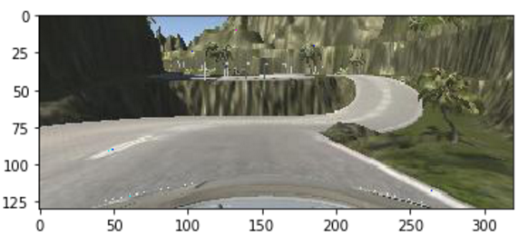
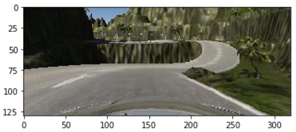
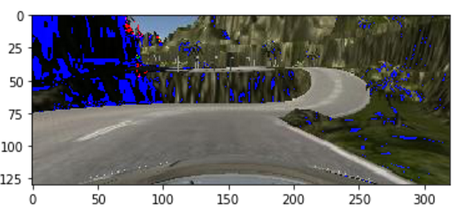
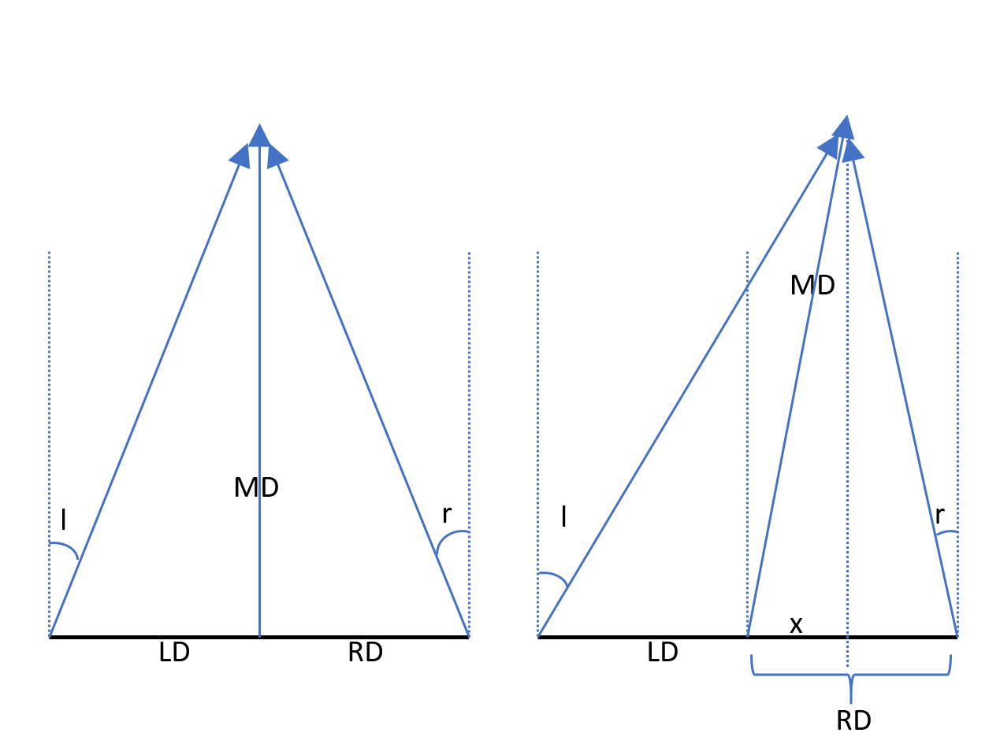
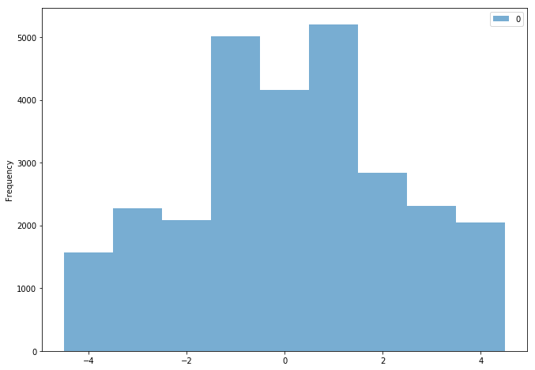
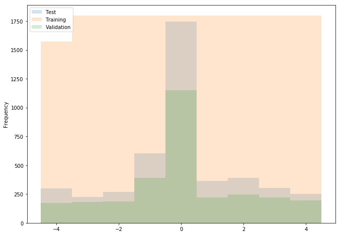
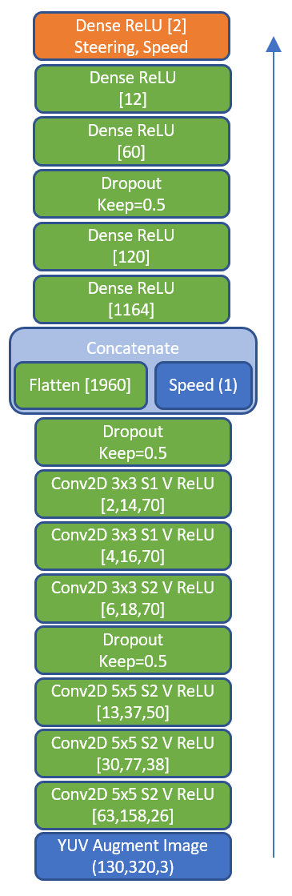
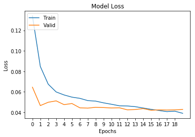

# Behavioral Cloning Project

Overview
---
This repository contains files to run my model and follow along. I DID NOT add pickle data because they were over 2GB in total.

#### [Simulator Download](https://github.com/udacity/self-driving-car-sim)

I used a Xbox 360 controller to drive around both tracks, clockwise and counterclockwise, to record data. I read the images, steering, and speed from CSV and saved them in a pickle binary files. 

My model was based on [NVIDIA's End to End Model](https://arxiv.org/pdf/1604.07316.pdf). I added a few layers to make my model accept 130x320x3 images and (scaled) speed, then output steering and speed. I used [Keras functional API](https://keras.io/getting-started/functional-api-guide/) to build my model.      

Files description: 
* behavioral_cloning.ipynb - Notebook used to import,explore and train
* drive.py - Script to run train model in autonomous mode
* modelV2D.h5 - My trained Keras model

To run the model in simulation mode: 
1) Activate carnd anaconda enviroment
2) Change to path of drive.p
3) Run python drive.p modelV2D.h5
4) Launch Unity Simulator
5) Click on Autonomous Mode

#### The Project
The goals / steps of this project are the following:
* Use the simulator and a Xbox controller to collect data of good driving behavior. 
* Design, train and validate a model that predicts a steering angle and speed from image data and current speed.
* Use the model (in drive.py) to drive the vehicle autonomously around the first track in the simulator. The vehicle should remain on the road for an entire loop around the track.

### Dependencies
---
This lab requires:

* [CarND Term1 Starter Kit](https://github.com/udacity/CarND-Term1-Starter-Kit)

The lab environment can be created with CarND Term1 Starter Kit. Click [here](https://github.com/udacity/CarND-Term1-Starter-Kit/blob/master/README.md) for the details.

The following resources can be found in this github repository:
* drive.py
* video.py
* writeup_template.md

Template project can be found [here](https://github.com/udacity/CarND-Behavioral-Cloning-P3).

---

The following sections serves as a summary to the [ipython notebook](behavioral_cloning.ipynb)
### Image Processing Definition

rgb2YUV - Function convert a set of images from RGB to YUV. YUV was chosen because that is the color space that NVIDIA used. YUV also makes easier to adjust brightness because Y channel represents brightness.

luminAugment - Adjust brightness of randomly chosen images of a set and append them to set. This function intends to be used after rgb2YUV.
 
Image below represent added brightness (Y-Channel)  

Image below is the original RGB  

Image below represent removing brightness (Y-Channel)  

steeringClassifier - Define class from -4 to 4 based on steering of the joystick from -1.0 to 1.0.

calcAdjAngle - Given a steering angle with respect to center image, the function return adjust steering if the car was position to the left or right. 

Trigonometry was used to calculate adjusted right and left steering angles. If the car is already turning right, then right camera should represent car steering left but not as much compared to center camera going straight. The left camera would represent car steering harder to the right.  

### Examine Data from Unity Training Capture

The steps are as follow in my ipython notebook:
1) Read CSV file generated from training mode.
2) Use CSV buffer to read image and store as numpy uint8 to save memory.
3) Use calcAdjAngle and append corresponding left and right images with adjusted angle.
4) You can copy scripts 1-3 and repeat to add training data as much as you like. I ran scripts 1-3 for both tracks but I spent more time on the hard track.
5) Use steeringClassifier to create a list. This list will be used to look at the steering angle distribution.
6) The last script balance the classes by shuffling and getting first x picture that balance the classes.

### Review my Captured Data

My images consisted of a majority of images from classes -1 to 1. This is expected because there are many semi-straight segment in both easy and hard track. I chose the first 1800 images from each class after shuffling.

Before Class Balancing:  

After class Balancing:  

### Build The NVIDIA End to End Model Using Keras Functional API

The model assumes that the input image is in YUV format and has shape of 130,320,3. My architecture describes how convolution as applied at each layer. For example 5x5 S2 V ReLU is 5x5 filter with stride of 2x2, valid padding and ReLU activation. The square brackets represent out shape at each layer. Speed in chosen as an auxiliary input because there should be a dependency between current speed versus predicted angle. By adding speed as an input, the model can decide if it is an important input or not based on training. Dropout was added to make sure model did not overfit. NVIDIA's models does not mention dropout.

### Define Generator Specific to Model

My training generator takes a pickle file path to load images in uint8 RBG format. Then the training generator function yield batches of regular and augmented YUV images. For simplicity, steps of generator should be the same as steps_per_epoch. The validation generator only yields YUV images with out augmentation. Since YUV is between 0.0 to 1.0, it is important for speed to be scaled from 30 to 1.0.
 
### Model Training and My Results

I trained the model over 20 epochs. The model at epoch 15 has the lowest validation loss, however, with this model the car went off of the easy track regularly. The model at epoch 17 was the next best and the weights was used as my final model. The final model also had great test loss.

Model Training:  

Model at Epoch 17:
* Test = 0.040288865147158501
* Validation = 0.04222614424072757
* Train = 0.040693088882084692

Here is the result for the easy track:

